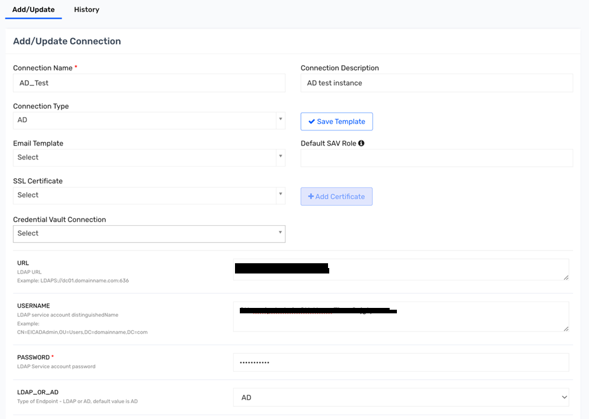

# Saviynt Active Directory (AD) Connector

The Saviynt Active Directory (AD) Connector enables seamless integration between Saviynt and Microsoft Active Directory, automating identity and access management tasks like provisioning, de-provisioning, and updating of user accounts and group memberships. This connector offers a range of capabilities for managing user identities, entitlements, and security policies, ensuring synchronized and secure identity data across the organization.

## Key Features of the Saviynt AD Connector

- **User Provisioning and De-provisioning**: 
  - Automates account creation, updates, and removal in AD.
  - Supports real-time and batch provisioning based on policies, reducing manual tasks and keeping accounts up-to-date.

- **Group Management**:
  - Manages group memberships and role assignments.
  - Automates group-based access to resources, ensuring users have permissions aligned with their roles.

- **Attribute Synchronization**:
  - Synchronizes attributes such as email, job title, department, and manager information between Saviynt and AD.
  - Maintains a single source of truth for user profile data across systems.

- **Password Management**:
  - Supports password synchronization, resets, and updates from Saviynt to AD.
  - Ensures compliance with password policies, reducing helpdesk workloads.

- **Entitlement and Policy Management**:
  - Manages AD entitlements, granting appropriate rights based on predefined policies.
  - Enforces security policies like Segregation of Duties (SoD) within AD.

- **Compliance and Auditing**:
  - Logs and audits all provisioning, de-provisioning, and access changes in AD.
  - Supports compliance by offering visibility into AD activities, such as access history.

- **Real-time Reconciliation and Role Management**:
  - Provides real-time data reconciliation between Saviynt and AD.
  - Supports role-based access control, aligning access rights with organizational policies.

## Benefits of the Saviynt AD Connector

- **Enhanced Security**: Automates identity lifecycle management, reducing risks associated with manual processes and ensuring alignment with security policies.
- **Increased Efficiency**: Reduces time on provisioning and de-provisioning, freeing IT resources for other tasks.
- **Improved Compliance**: Logs and audit trails support regulatory requirements, ensuring accountability for AD changes.
- **Centralized Identity Management**: Integrates AD with Saviynt's centralized IAM solution, providing a comprehensive view of identity and access.

## Sample AD Connector

### Introduction

Saviynt EIC provides out-of-the-box (OOB) capability to integrate AD applications using the AD Connector, with configurable OOB templates.

### How it Works

Saviynt offers a connector module to establish connections with AD for identity management tasks.

### Prerequisites

- Ensure network connectivity is in place for operations like reconciliation and provisioning. The network should be whitelisted and the firewall must permit traffic between Saviynt and AD.

### Integration Steps

1. **Create an AD Connection**:
   - Provide a connection name and description.
   - Select the connection type as AD.
   - Enter the URL of the AD instance to connect.
   - Provide the username and password for authentication.
	 
	
   

   - Specify whether it is AD or LDAP.
   
2. **Configure Search and Object Filters**:
   - Set a search filter as the starting point for importing data (e.g., `o=jgty.com`).
   - Define an object filter as a logical expression, e.g., `(&(objectClass=jgtyPerson)(jgtySerialNumber=*))`.

	

3. **Map Account Attributes**:
   - Example mapping includes:
     - `name`: Maps to `jgtySerialNumber` (main identifier).
     - `objectGUID`: Maps to `customproperty1` (Reconciliation Field).
     - `msDS-UserAccountDisabled`: Maps to `customproperty20` (account status).
   - Map additional attributes as needed for user identity data.

4. **Define Entitlement and Page Size**:
   - Specify entitlement attributes and page size (number of records returned per call).


5. **Define JSON Templates for Account Operations**:
   - **Create Account JSON**: Define parameters like `objectClass`, `jgtySerialNumber`, `sn`, `mail`, `manager`, etc.
   - **Update Account JSON**: Modify existing account details as needed using similar attributes.
   
	 

6. **Set Additional Options**:
   - **Base**: Set a base search filter, e.g., `OU=HiFind,O=jgty.com`.
   - **Account Name Rule**: Define rules for generating account names from Saviynt data.
   
	


7. **Remove Account Action**:
   - Define a JSON structure for account deletion, e.g., `{ "distinguishedName": "${account.accountID}", "removeAction": "DELETE" }`.

	

8. **Configure Password Policies**:
   - Define rules such as minimum and maximum password lengths, required capital letters, digits, and special characters.
	
	
	
9. **Status Threshold Configuration**:
   - Configure thresholds for active and inactive account statuses, e.g., using `customproperty30` as the status column.
   
	

### Troubleshooting

Common errors may include SSL handshake failures. For example:

```text
ldap.SaviyntGroovyLdapService - Checking for URL = ldaps://host:636
Exception: javax.net.ssl.SSLHandshakeException
