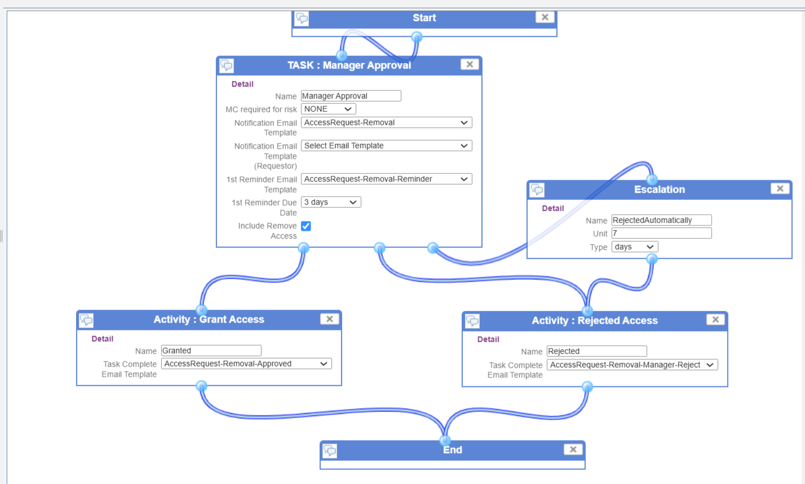
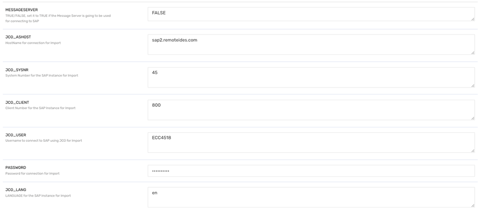
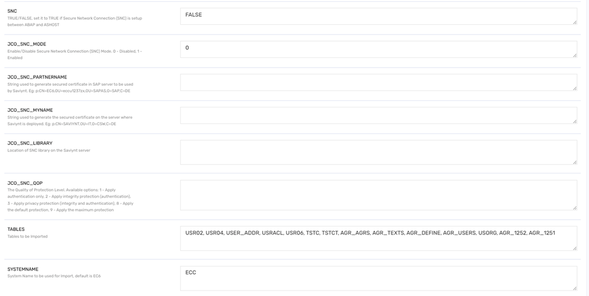
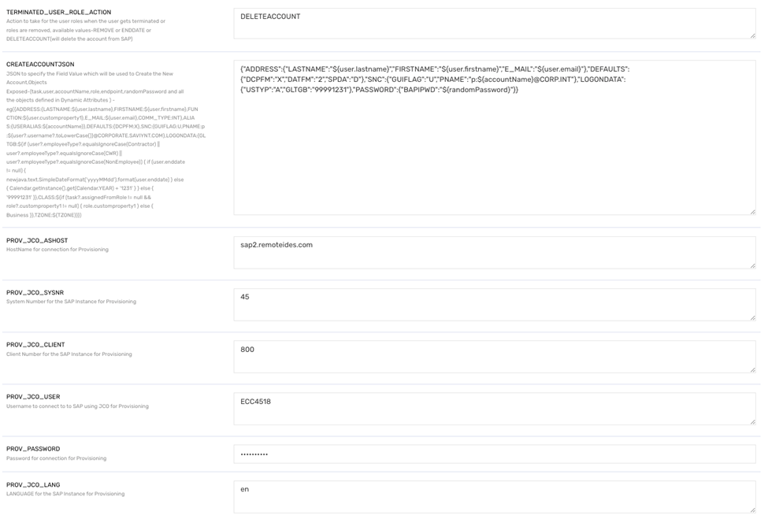
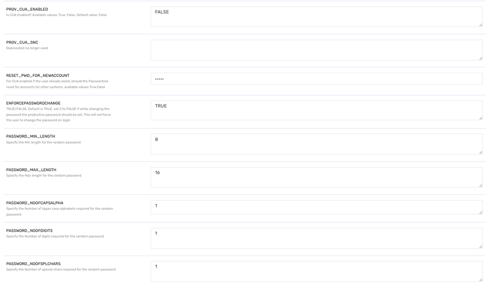
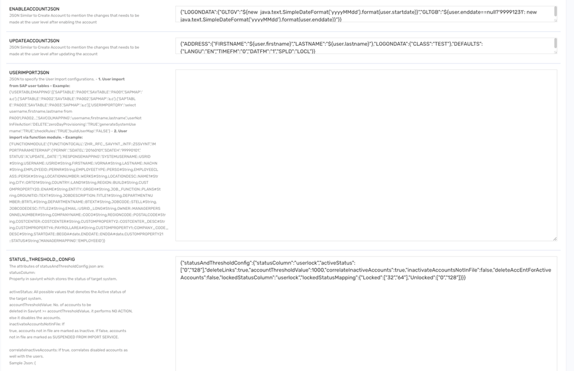

# Sample SAP Connector Setup Guide

## Introduction
Saviynt EIC offers out-of-the-box (OOB) capabilities to integrate SAP applications with Saviynt using SAP connectors. Saviynt provides OOB templates that can be configured accordingly.

## How It Works
Saviynt’s connector module can be configured to establish a connection with the SAP application.

## Prerequisites
Before starting operations like reconciliation and provisioning, network connectivity must be set up. Ensure the network is whitelisted, and firewall rules allow network traffic between Saviynt and the SAP system.

## Integration Steps
To create an SAP connection, follow these steps:

1. Set a connection name.

	

2. Select the connection type as SAP to load the SAP-specific template.

	
	
3. **MESSAGESERVER**: Set to `TRUE` if a Message Server is used; typically, this is set to `FALSE`.
4. **JCO_AHOST**: Hostname for the SAP instance connection for data import.
5. **JCO_SYSNR**: System number of the SAP instance for import.
6. **JCO_CLIENT**: Client number for the SAP instance.
7. **JCO_USER**: Username for connecting to SAP.
8. **Password**: Password for the SAP connection.
9. **JCO_LANG**: Language for the SAP instance (e.g., `EN` for English).

	

10. **SNC**: Set to `TRUE` if Secure Network Connection (SNC) is enabled.
11. **JCO_SNC_MODE**: Enable/Disable SNC mode (`0` for disabled, `1` for enabled).
12. **Tables**: Include the following tables in order: USR02, USR04, USER_ADDR, USRACL, USR06, TSTC, TSTCT, AGR_AGRS, AGR_TEXTS, AGR_DEFINE, AGR_USERS, USORG, AGR_1252, AGR_1251.
13. **SYSTEMNAME**: System name for data import; default is `EC6`.
14. **TERMINATED_USER_ROLE_ACTION**: Set to `DELETEACCOUNT` to delete roles for terminated users.

## Provisioning JSON Configuration

	

15. **Create Account JSON**: JSON format to specify new account details.
    ```json
    {
       "ADDRESS": {
          "LASTNAME": "${user.lastname}",
          "FIRSTNAME": "${user.firstname}",
          "E_MAIL": "${user.email}"
       },
       "DEFAULTS": {
          "DCPFM": "X",
          "DATFM": "2",
          "SPDA": "D"
       },
       "SNC": {
          "GUIFLAG": "U",
          "PNAME": "p:${accountName}@CORP.INT"
       },
       "LOGONDATA": {
          "USTYP": "A",
          "GLTGB": "99991231"
       },
       "PASSWORD": {
          "BAPIPWD": "${randomPassword}"
       }
    }
    ```

## Other Configuration Parameters

16. **PROV_JCO_AHOST**: Hostname for provisioning connection.
17. **PROV_JCO_SYSNR**: System number for provisioning.
18. **PROV_JCO_CLIENT**: Client number for provisioning.
19. **PROV_JCO_USER**: Username for provisioning.
20. **PROV_Password**: Password for provisioning.
21. **PROV_JCO_LANG**: Language for provisioning (e.g., `EN`).

	

22. **PROV_CUA_ENABLED**: `FALSE` by default.
23. **RESET_PWD_FOR_NEWACCOUNT**: Determines if passwords should reset for pre-existing users in CUA-enabled systems.

	

## Additional JSON Configurations

24. **ENABLEACCOUNTJSON**: Used to define account-level changes upon enabling the account.
    ```json
    {
       "LOGONDATA": {
          "GLTGV": "${new java.text.SimpleDateFormat('yyyyMMdd').format(user.startdate)}",
          "GLTGB": "${user.enddate==null?'99991231': new java.text.SimpleDateFormat('yyyyMMdd').format(user.enddate)}"
       }
    }
    ```

25. **UPDATEACCOUNTJSON**: Defines updates at the user level.
    ```json
    {
       "ADDRESS": {
          "FIRSTNAME": "${user.firstname}",
          "LASTNAME": "${user.lastname}"
       },
       "LOGONDATA": {
          "CLASS": "TEST"
       },
       "DEFAULTS": {
          "LANGU": "EN",
          "TIMEFM": "0",
          "DATFM": "1",
          "SPLD": "LOCL"
       }
    }
    ```

## Status and Threshold Configuration
26. **STATUS_THRESHOLD_CONFIG**: Manages account status thresholds.
    ```json
    {
       "statusAndThresholdConfig": {
          "statusColumn": "userlock",
          "activeStatus": ["0", "128"],
          "deleteLinks": true,
          "accountThresholdValue": 1000,
          "correlateInactiveAccounts": true,
          "inactivateAccountsNotInFile": false,
          "deleteAccEntForActiveAccounts": false,
          "lockedStatusColumn": "userlock",
          "lockedStatusMapping": {
             "Locked": ["32", "64"],
             "Unlocked": ["0", "128"]
          }
       }
    }
    ```

## Troubleshooting
Common connection errors:
- **JCoException** errors like "Destination 264416 does not exist."
- **IllegalStateException** errors related to the DestinationDataProvider.
- **JCO_ERROR_DESTINATION_DATA_INVALID**: Check SAP configuration.

### Resolution
Add `sap.usefilebasedapproach=true` to `externalconfig.properties` to resolve SAP connection issues.
