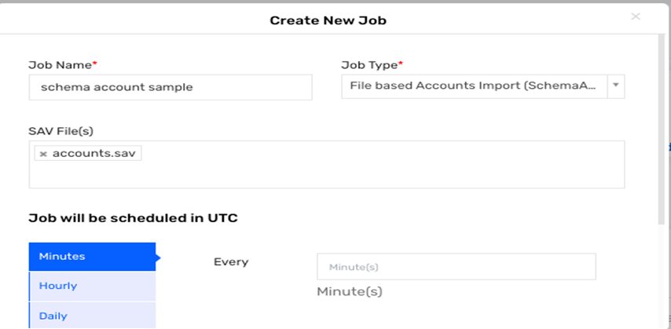

# Schema-Based File Account Import in Saviynt EIC

## Introduction
Saviynt Enterprise Identity Cloud (EIC) provides an out-of-the-box (OOB) capability to automate manual account reconciliation using schema-based account import. This process enables efficient synchronization of account data through schema-based jobs configured within Saviynt.

## How It Works
Saviynt’s schema-based account jobs allow for the automated reconciliation (recon) of manually managed accounts by importing data files into the system.

## Prerequisites
To run schema-based jobs, the following file setup is required:
- **SAV Files**: Located in the **File** directory.
- **CSV Files**: Stored in the **Datafiles** directory, with the file name beginning with the specified prefix in the `FileNameStartswith` property.
- Ensure that the SAV file name includes the suffix **"Accounts"**.

## Integration Steps

### Step 1: Create the SAV File
Create a `.sav` configuration file with account import properties, and place it in the `sav` folder under the `File` directory.

#### Explanation of SAV File Properties:
- **SystemName**: Specifies the name of the security system (e.g., `SampleSS`).
- **FileNameStartswith**: Identifies the prefix for CSV files in the `Datafiles` folder that will be processed.
- **DELETEACCOUNTENTITLEMENT**: Defines whether to remove account-to-entitlement mappings for existing accounts in Saviynt.
  - `YES`: Removes account-entitlement mappings.
  - `NO`: Retains account-entitlement mappings.
- **FILEIMPORTDELIMETER**: Specifies the delimiter used in the CSV file (e.g., comma `,`).
- **IGNOREFIRSTLINE**: Set to `True` to skip the first line in the CSV file if it contains column headers.
- **ACCOUNTNAME, endpointname, status, CUSTOMPROPERTY1**: Defines the order of columns in the CSV file.

### Step 2: Create the CSV File
Create a CSV file that matches the schema defined in the SAV file and place it in the `Datafiles` directory.

#### Example CSV File:
```plaintext
ACCOUNTNAME,endpointname,status,ABCD
DocUsername1ACC01,SampleED,1,abcd

### Step 3: Schedule the Job in the EIC Control Panel
Navigate to the Job Control Panel in Saviynt EIC and create a new job:
1. Select the job type **File-Based Accounts Import (SchemaAccount)**.
2. Schedule the job according to your organization’s requirements.

### Step 4: Review Job Results
- **Success**: After a successful job run, the CSV file will be moved to the `success` folder for archiving.
- **Failure**: If the job fails, the CSV file will be moved to the `fail` folder for troubleshooting.

	

## Account and Entitlement Correlation
Account and entitlement data can be imported together, enabling correlation during the import process.

#### Example SAV File for Account and Entitlement Correlation (`Import_Accounts.sav`):
```plaintext
FileNameStartswith=SchemaAccounts
DELETEACCOUNTENTITLEMENT=NO
ACCOUNT_NOT_IN_FILE_ACTION=NOACTION
IGNOREFIRSTLINE=True
FILEIMPORTDELIMETER=,
#EMAILTEMPLATE=
OVERWRITE_USER_ASSIGNED=TRUE
ACCOUNTNAME,endpointname,status,CUSTOMPROPERTY1,entitlementtype,entitlement_value

## Troubleshooting

This section outlines common issues and solutions related to schema-based file account imports in Saviynt EIC.

### Common Issues and Resolutions

1. **File Not Found Error**
   - **Cause**: The specified CSV file or SAV file is missing from the required directory.
   - **Resolution**: Verify that:
     - The latest CSV file is present in the `Datafiles` directory.
     - The SAV file is correctly placed in the `sav` folder within the `File` directory.
     - Ensure the CSV file name begins with the string specified in the `FileNameStartswith` property of the SAV file.

2. **Incorrect File Format Error**
   - **Cause**: The format or structure of the CSV file does not match the schema defined in the SAV file.
   - **Resolution**: Check that:
     - The CSV file columns are in the exact order specified in the SAV file.
     - The delimiter in the CSV matches the `FILEIMPORTDELIMETER` property (e.g., comma `,`).
     - If the first line in the CSV file contains headers, ensure `IGNOREFIRSTLINE=True` is set in the SAV file.

3. **Account and Entitlement Mapping Issues**
   - **Cause**: Account-to-entitlement mappings are not correctly set or have discrepancies.
   - **Resolution**: Ensure that:
     - The `DELETEACCOUNTENTITLEMENT` property is set correctly in the SAV file:
       - `YES`: Removes account-entitlement mappings.
       - `NO`: Retains existing account-entitlement mappings.
     - The entitlements listed in the CSV match the structure in Saviynt and follow the naming convention defined.

4. **File Processing Delays**
   - **Cause**: Scheduled job delays or large data files causing longer processing times.
   - **Resolution**:
     - Check the job schedule in the Saviynt Job Control Panel to ensure no conflicting jobs are running simultaneously.
     - For large files, consider splitting the data into multiple smaller files or scheduling the job during low-traffic times.

5. **Job Failure with No Specific Error**
   - **Cause**: Unknown error possibly due to file corruption or system-level issues.
   - **Resolution**:
     - Verify the integrity of the CSV and SAV files by reopening or regenerating them if needed.
     - Check system logs in Saviynt EIC for additional error details.
     - Re-run the job manually to see if the issue persists.

### Additional Tips
- **Archiving**: After a successful job, the CSV file moves to the `success` folder. If the job fails, the file moves to the `fail` folder. Check these folders regularly to monitor job results and troubleshoot as necessary.
- **Logs**: Review logs in Saviynt EIC for specific error codes or messages for deeper insights into job execution failures.

By following these troubleshooting steps, you can address common issues and optimize the schema-based file account import process in Saviynt.
